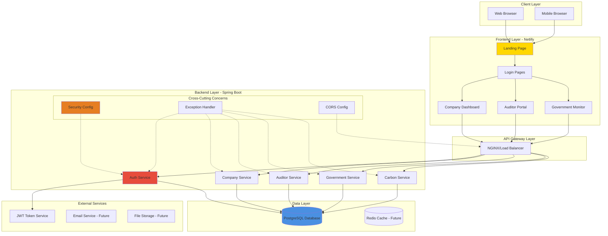

# High-Level Design (HLD) - CarbonSync Platform

## System Architecture Overview

## Technology Stack

### Frontend
- **Framework**: Vanilla HTML5, CSS3, JavaScript
- **Styling**: Custom CSS with variables, components, animations
- **3D Graphics**: Spline for globe animation
- **Deployment**: Netlify (Static hosting)

### Backend
- **Framework**: Spring Boot 3.2.4
- **Language**: Java 17
- **Build Tool**: Maven
- **Security**: Spring Security + JWT (Planned)
- **Validation**: Jakarta Validation
- **Deployment**: Railway/Heroku (Planned)

### Database
- **Primary DB**: PostgreSQL (Planned - Currently using stubs)
- **Caching**: Redis (Future enhancement)
- **ORM**: Spring Data JPA (To be wired)

### DevOps
- **Version Control**: Git + GitHub
- **CI/CD**: GitHub Actions (Planned)
- **Monitoring**: Spring Actuator + Prometheus (Planned)
- **Logging**: SLF4J + Logback

## System Layers

### 1. Presentation Layer (Frontend)
- **Responsibility**: User interface and user experience
- **Components**: Landing, Company Dashboard, Auditor Portal, Government Monitor
- **Communication**: REST API calls to backend

### 2. API Layer (Controllers)
- **Responsibility**: HTTP request handling, routing
- **Components**: AuthController, CompanyController, AuditorController, GovernmentController, CarbonController
- **Pattern**: RESTful architecture

### 3. Business Logic Layer (Services)
- **Responsibility**: Core business logic, validation, processing
- **Components**: AuthService, CompanyService, AuditorService, GovernmentService, CarbonService
- **Pattern**: Service layer pattern

### 4. Data Access Layer (Repositories)
- **Responsibility**: Database operations
- **Components**: Spring Data JPA repositories (Planned)
- **Pattern**: Repository pattern

### 5. Data Layer (Database)
- **Responsibility**: Data persistence
- **Components**: PostgreSQL with normalized schema
- **Pattern**: Relational database design

## Design Principles

1. **Separation of Concerns**: Clear layer boundaries
2. **Single Responsibility**: Each component has one job
3. **Dependency Injection**: Spring manages object lifecycle
4. **RESTful API Design**: Standard HTTP methods and status codes
5. **Security First**: Authentication and authorization at every layer
6. **Scalability**: Stateless backend, horizontal scaling ready
7. **Maintainability**: Clean code, clear naming conventions

## Non-Functional Requirements

- **Performance**: API response time < 200ms
- **Availability**: 99.9% uptime target
- **Scalability**: Handle 10,000+ concurrent users
- **Security**: HTTPS, JWT tokens, input validation
- **Reliability**: Automated backups, error recovery
- **Maintainability**: Clean code, comprehensive documentation
