# Low-Level Design (LLD) - CarbonSync Platform

## Component Architecture

```mermaid
graph TB
    subgraph Frontend["Frontend Components"]
        UI_LANDING[Landing Page]
        UI_AUTH[Authentication Forms]
        UI_COMPANY[Company Dashboard]
        UI_AUDITOR[Auditor Portal]
        UI_GOVT[Government Monitor]
        NAV[Navigation Bar]
        SIDEBAR[Sidebar Menu]
        CHARTS[Chart Components]
        TABLES[Data Tables]
        FORMS[Form Components]
    end
    
    subgraph Controllers["Backend Controllers"]
        AUTH_CTRL[AuthController]
        COMPANY_CTRL[CompanyController]
        AUDITOR_CTRL[AuditorController]
        GOVT_CTRL[GovernmentController]
        CARBON_CTRL[CarbonController]
    end
    
    subgraph Services["Service Layer"]
        AUTH_SVC[AuthService]
        COMPANY_SVC[CompanyService]
        AUDITOR_SVC[AuditorService]
        GOVT_SVC[GovernmentService]
        CARBON_SVC[CarbonService]
    end
    
    subgraph DTOs["Data Transfer Objects"]
        LOGIN_REQ[LoginRequest]
        SIGNUP_REQ[SignupRequest]
        AUTH_RESP[AuthResponse]
        COMPANY_DTO[CompanyDto]
        AUDITOR_DTO[AuditorDto]
        GOVT_DTO[GovernmentDto]
    end
    
    subgraph Models["Models/Entities"]
        COMPANY[Company]
        AUDITOR[Auditor]
        GOVT[GovernmentBody]
        CARBON[CarbonEntry]
    end
    
    subgraph Repos["Repositories"]
        COMPANY_REPO[CompanyRepository]
        AUDITOR_REPO[AuditorRepository]
        GOVT_REPO[GovernmentRepository]
        CARBON_REPO[CarbonRepository]
    end
    
    subgraph Utils["Utility Components"]
        RESPONSE[ResponseWrapper]
        EXCEPTION[GlobalExceptionHandler]
        SECURITY[SecurityConfig]
        CORS_CONFIG[CorsConfig]
    end
    
    UI_COMPANY --> COMPANY_CTRL
    UI_AUDITOR --> AUDITOR_CTRL
    UI_GOVT --> GOVT_CTRL
    UI_AUTH --> AUTH_CTRL
    
    AUTH_CTRL --> AUTH_SVC
    COMPANY_CTRL --> COMPANY_SVC
    AUDITOR_CTRL --> AUDITOR_SVC
    GOVT_CTRL --> GOVT_SVC
    CARBON_CTRL --> CARBON_SVC
    
    AUTH_CTRL --> LOGIN_REQ
    AUTH_CTRL --> SIGNUP_REQ
    AUTH_SVC --> AUTH_RESP
    
    COMPANY_SVC --> COMPANY
    AUDITOR_SVC --> AUDITOR
    GOVT_SVC --> GOVT
    CARBON_SVC --> CARBON
    
    COMPANY_SVC --> COMPANY_REPO
    AUDITOR_SVC --> AUDITOR_REPO
    GOVT_SVC --> GOVT_REPO
    CARBON_SVC --> CARBON_REPO
    
    COMPANY_CTRL --> RESPONSE
    AUDITOR_CTRL --> RESPONSE
    GOVT_CTRL --> RESPONSE
    CARBON_CTRL --> RESPONSE
    
    EXCEPTION -.-> AUTH_CTRL
    EXCEPTION -.-> COMPANY_CTRL
    EXCEPTION -.-> AUDITOR_CTRL
    EXCEPTION -.-> GOVT_CTRL
    EXCEPTION -.-> CARBON_CTRL
    
    style AUTH_SVC fill:#E74C3C
    style RESPONSE fill:#2ECC71
    style EXCEPTION fill:#E67E22
    style SECURITY fill:#9B59B6
```



## Class Details

### Controllers

#### AuthController
```java
@RestController
@RequestMapping("/api/auth")
public class AuthController {
    - AuthService authService
    
    + ResponseEntity<ResponseWrapper<AuthResponse>> signup(SignupRequest)
    + ResponseEntity<ResponseWrapper<AuthResponse>> login(LoginRequest)
}
```

#### CompanyController
```java
@RestController
@RequestMapping("/api/companies")
public class CompanyController {
    - CompanyService companyService
    
    + ResponseEntity<ResponseWrapper<List<Company>>> getAll()
    + ResponseEntity<ResponseWrapper<Company>> getById(Long id)
    + ResponseEntity<ResponseWrapper<Company>> create(Company company)
}
```

#### CarbonController
```java
@RestController
@RequestMapping("/api/carbon")
public class CarbonController {
    - CarbonService carbonService
    
    + ResponseEntity<ResponseWrapper<List<CarbonEntry>>> getAll()
    + ResponseEntity<ResponseWrapper<List<CarbonEntry>>> getByCompany(Long companyId)
    + ResponseEntity<ResponseWrapper<CarbonEntry>> getById(Long id)
    + ResponseEntity<ResponseWrapper<CarbonEntry>> create(CarbonEntry entry)
}
```

### Services

#### AuthService
```java
@Service
public class AuthService {
    + AuthResponse login(LoginRequest request)
    + AuthResponse signup(SignupRequest request)
    // Future: validateToken(), refreshToken(), logout()
}
```

#### CompanyService
```java
@Service
public class CompanyService {
    - List<Company> STUB // Temporary stub data
    
    + List<Company> getAll()
    + Company getById(Long id)
    + Company create(Company company)
    // Future: update(), delete(), search()
}
```

#### CarbonService
```java
@Service
public class CarbonService {
    - List<CarbonEntry> STUB
    
    + List<CarbonEntry> getAll()
    + List<CarbonEntry> getByCompany(Long companyId)
    + CarbonEntry getById(Long id)
    + CarbonEntry create(CarbonEntry entry)
    // Future: update(), delete(), calculateTotal()
}
```

### Models

#### Company
```java
@Data @Builder @NoArgsConstructor @AllArgsConstructor
public class Company {
    private Long id;
    private String name;
    private String industry;
    private Double emissionTarget; // tonnes CO₂e
}
```

#### CarbonEntry
```java
@Data @Builder @NoArgsConstructor @AllArgsConstructor
public class CarbonEntry {
    private Long id;
    private Long companyId; // Foreign key
    private Double emissionValue; // tonnes CO₂e
    private Double creditBalance; // carbon credits
    private String reportDate; // ISO-8601 date
}
```

#### Auditor
```java
@Data @Builder @NoArgsConstructor @AllArgsConstructor
public class Auditor {
    private Long id;
    private String name;
    private String agencyName;
    private String certificationId;
}
```

#### GovernmentBody
```java
@Data @Builder @NoArgsConstructor @AllArgsConstructor
public class GovernmentBody {
    private Long id;
    private String name;
    private String jurisdiction; // Central, State
    private String role; // Regulator, Monitor
}
```

### DTOs

#### SignupRequest
```java
public class SignupRequest {
    @NotBlank private String name;
    @Email @NotBlank private String email;
    @NotBlank private String password;
    @NotBlank private String role; // COMPANY | AUDITOR | GOVERNMENT
}
```

#### LoginRequest
```java
public class LoginRequest {
    @Email @NotBlank private String email;
    @NotBlank private String password;
}
```

#### AuthResponse
```java
public class AuthResponse {
    private String token; // JWT token
    private String email;
    private String role;
}
```

### Utilities

#### ResponseWrapper
```java
public class ResponseWrapper<T> {
    private String status; // "success" | "error"
    private String message;
    private T data;
    
    + static <T> ResponseWrapper<T> success(T data)
    + static <T> ResponseWrapper<T> error(String message)
}
```

#### GlobalExceptionHandler
```java
@RestControllerAdvice
public class GlobalExceptionHandler {
    + ResponseEntity<ResponseWrapper<?>> handleNotFound(ResourceNotFoundException)
    + ResponseEntity<ResponseWrapper<?>> handleValidation(MethodArgumentNotValidException)
    + ResponseEntity<ResponseWrapper<?>> handleGeneric(Exception)
}
```

## Design Patterns Used

1. **MVC Pattern**: Controllers, Services, Models separation
2. **DTO Pattern**: Data transfer between layers
3. **Repository Pattern**: Data access abstraction
4. **Builder Pattern**: Model object construction (Lombok)
5. **Singleton Pattern**: Spring-managed beans
6. **Dependency Injection**: Constructor injection
7. **Exception Handling Pattern**: Global exception handler
8. **Response Wrapper Pattern**: Consistent API responses

## API Response Format

All endpoints return this structure:
```json
{
  "status": "success | error",
  "message": "OK | Error description",
  "data": { ... } // null on error
}
```

## Error Handling Strategy

1. **404 Not Found**: ResourceNotFoundException → HTTP 404
2. **400 Bad Request**: Validation errors → HTTP 400
3. **500 Internal Error**: Unexpected exceptions → HTTP 500
4. **401 Unauthorized**: Auth failures → HTTP 401 (Planned)
5. **403 Forbidden**: Permission denied → HTTP 403 (Planned)
