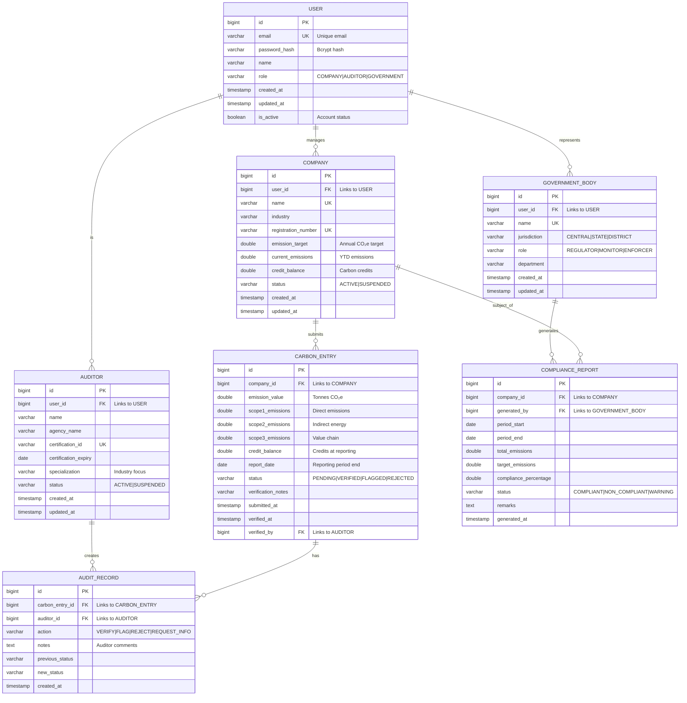

# Entity-Relationship Diagram (ERD) - CarbonSync Database

## Database Schema



## Table Descriptions

### USER
- **Purpose**: Stores authentication and basic profile information for all users
- **Relationships**: One-to-many with Company, Auditor, GovernmentBody
- **Indexes**: email (unique), role
- **Security**: password_hash uses Bcrypt with salt

### COMPANY
- **Purpose**: Stores registered companies tracking emissions
- **Relationships**: 
  - Belongs to one USER
  - Has many CARBON_ENTRY records
  - Has many COMPLIANCE_REPORT records
- **Indexes**: user_id, registration_number (unique), name (unique)
- **Business Rules**:
  - emission_target must be positive
  - current_emissions calculated from CARBON_ENTRY
  - credit_balance cannot be negative

### AUDITOR
- **Purpose**: Stores certified auditors who verify emissions data
- **Relationships**: 
  - Belongs to one USER
  - Has many AUDIT_RECORD records
- **Indexes**: user_id, certification_id (unique)
- **Business Rules**:
  - certification_expiry must be future date
  - Only ACTIVE auditors can verify entries

### GOVERNMENT_BODY
- **Purpose**: Stores government regulatory bodies monitoring compliance
- **Relationships**: 
  - Belongs to one USER
  - Has many COMPLIANCE_REPORT records
- **Indexes**: user_id, name (unique)
- **Business Rules**:
  - jurisdiction follows hierarchy: CENTRAL > STATE > DISTRICT

### CARBON_ENTRY
- **Purpose**: Stores individual carbon emission reports submitted by companies
- **Relationships**: 
  - Belongs to one COMPANY
  - Has many AUDIT_RECORD records
  - Has one verifying AUDITOR (optional)
- **Indexes**: company_id, report_date, status, verified_by
- **Business Rules**:
  - emission_value = scope1_emissions + scope2_emissions + scope3_emissions
  - status transitions: PENDING → VERIFIED/FLAGGED/REJECTED
  - verified_by required when status = VERIFIED
  - report_date cannot be future date

### AUDIT_RECORD
- **Purpose**: Audit trail for all actions taken on carbon entries
- **Relationships**: 
  - Belongs to one CARBON_ENTRY
  - Belongs to one AUDITOR
- **Indexes**: carbon_entry_id, auditor_id, created_at
- **Business Rules**:
  - Immutable (no updates/deletes)
  - created_at auto-populated
  - action must be valid enum value

### COMPLIANCE_REPORT
- **Purpose**: Periodic compliance assessments generated by government bodies
- **Relationships**: 
  - Belongs to one COMPANY
  - Belongs to one GOVERNMENT_BODY (generator)
- **Indexes**: company_id, generated_by, period_end
- **Business Rules**:
  - period_end > period_start
  - compliance_percentage = (target_emissions / total_emissions) * 100
  - status auto-calculated from compliance_percentage

## Database Constraints

### Foreign Keys
```sql
ALTER TABLE company ADD CONSTRAINT fk_company_user 
    FOREIGN KEY (user_id) REFERENCES user(id) ON DELETE CASCADE;

ALTER TABLE auditor ADD CONSTRAINT fk_auditor_user 
    FOREIGN KEY (user_id) REFERENCES user(id) ON DELETE CASCADE;

ALTER TABLE government_body ADD CONSTRAINT fk_govt_user 
    FOREIGN KEY (user_id) REFERENCES user(id) ON DELETE CASCADE;

ALTER TABLE carbon_entry ADD CONSTRAINT fk_carbon_company 
    FOREIGN KEY (company_id) REFERENCES company(id) ON DELETE CASCADE;

ALTER TABLE carbon_entry ADD CONSTRAINT fk_carbon_auditor 
    FOREIGN KEY (verified_by) REFERENCES auditor(id) ON DELETE SET NULL;

ALTER TABLE audit_record ADD CONSTRAINT fk_audit_carbon 
    FOREIGN KEY (carbon_entry_id) REFERENCES carbon_entry(id) ON DELETE CASCADE;

ALTER TABLE audit_record ADD CONSTRAINT fk_audit_auditor 
    FOREIGN KEY (auditor_id) REFERENCES auditor(id) ON DELETE CASCADE;

ALTER TABLE compliance_report ADD CONSTRAINT fk_compliance_company 
    FOREIGN KEY (company_id) REFERENCES company(id) ON DELETE CASCADE;

ALTER TABLE compliance_report ADD CONSTRAINT fk_compliance_govt 
    FOREIGN KEY (generated_by) REFERENCES government_body(id) ON DELETE SET NULL;
```

### Check Constraints
```sql
ALTER TABLE company ADD CONSTRAINT chk_emission_target 
    CHECK (emission_target > 0);

ALTER TABLE company ADD CONSTRAINT chk_credit_balance 
    CHECK (credit_balance >= 0);

ALTER TABLE carbon_entry ADD CONSTRAINT chk_emission_value 
    CHECK (emission_value >= 0);

ALTER TABLE carbon_entry ADD CONSTRAINT chk_report_date 
    CHECK (report_date <= CURRENT_DATE);

ALTER TABLE compliance_report ADD CONSTRAINT chk_period_range 
    CHECK (period_end > period_start);
```

## Indexes for Performance

```sql
-- User lookup by email (authentication)
CREATE UNIQUE INDEX idx_user_email ON user(email);

-- Company queries by industry and status
CREATE INDEX idx_company_industry ON company(industry);
CREATE INDEX idx_company_status ON company(status);

-- Carbon entry queries (most frequent)
CREATE INDEX idx_carbon_company_date ON carbon_entry(company_id, report_date DESC);
CREATE INDEX idx_carbon_status ON carbon_entry(status);
CREATE INDEX idx_carbon_verified_by ON carbon_entry(verified_by);

-- Audit trail queries
CREATE INDEX idx_audit_carbon ON audit_record(carbon_entry_id, created_at DESC);
CREATE INDEX idx_audit_auditor ON audit_record(auditor_id, created_at DESC);

-- Compliance report queries
CREATE INDEX idx_compliance_company ON compliance_report(company_id, period_end DESC);
CREATE INDEX idx_compliance_status ON compliance_report(status);
```

## Data Types & Size Estimates

| Table | Estimated Rows | Growth Rate | Storage (approx) |
|-------|----------------|-------------|------------------|
| USER | 1,000 | 50/month | 100 KB |
| COMPANY | 500 | 20/month | 50 KB |
| AUDITOR | 50 | 5/month | 10 KB |
| GOVERNMENT_BODY | 20 | 1/year | 5 KB |
| CARBON_ENTRY | 50,000 | 2,000/month | 5 MB |
| AUDIT_RECORD | 100,000 | 4,000/month | 8 MB |
| COMPLIANCE_REPORT | 5,000 | 200/month | 500 KB |

**Total estimated storage (1 year)**: ~30 MB (metadata + indexes: ~100 MB)
