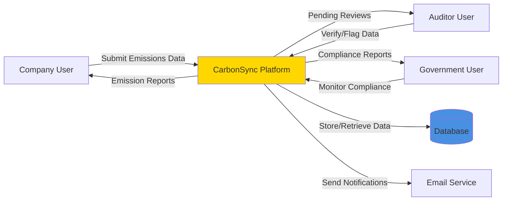
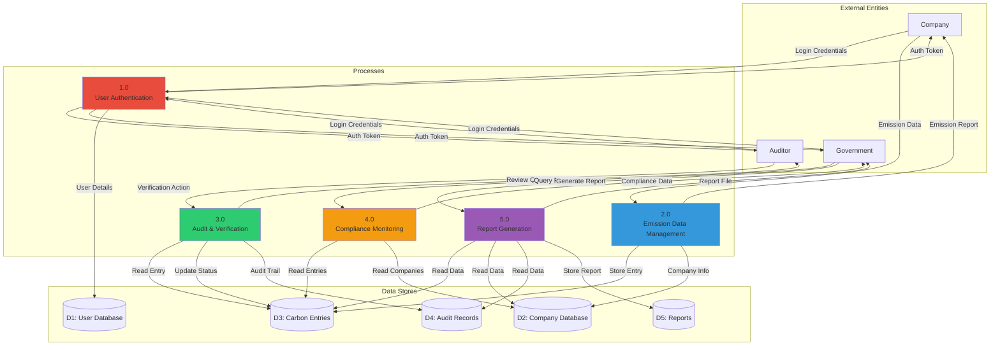
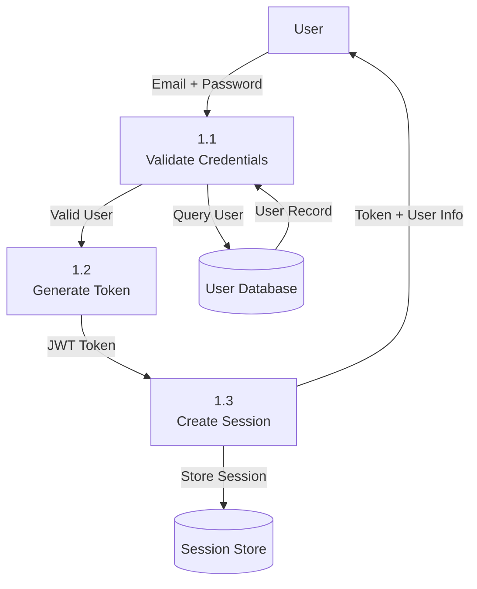
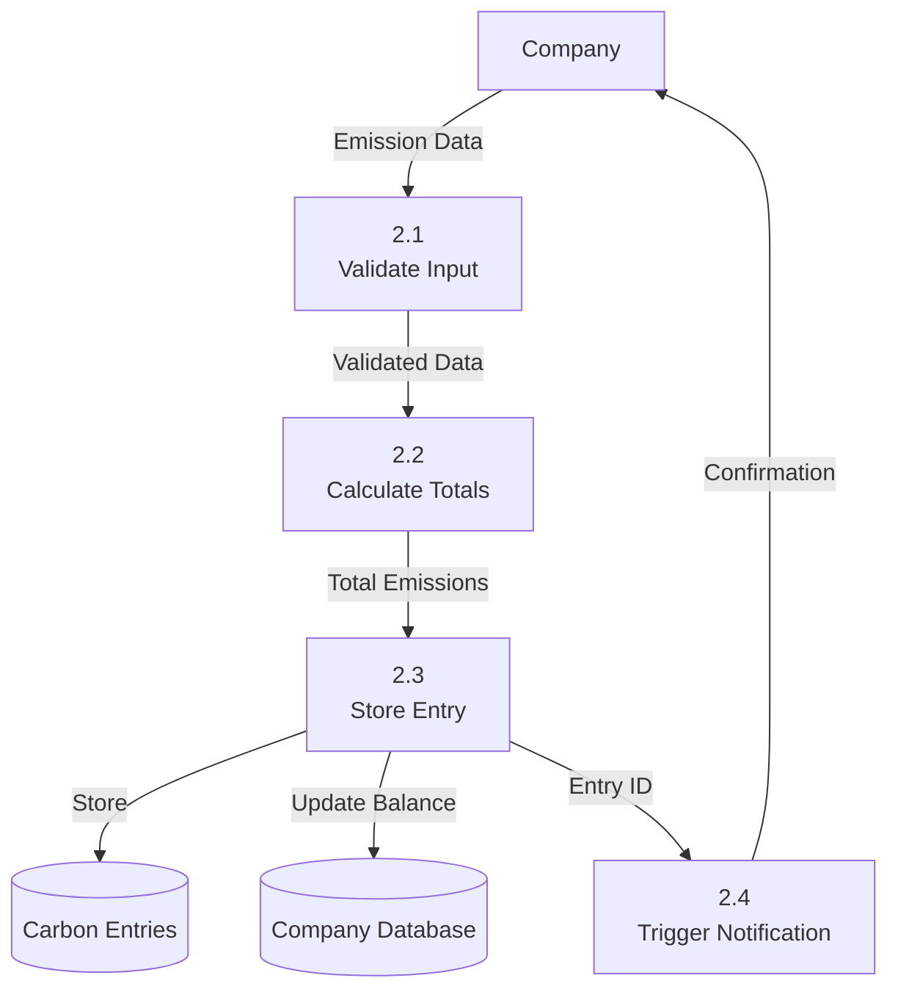
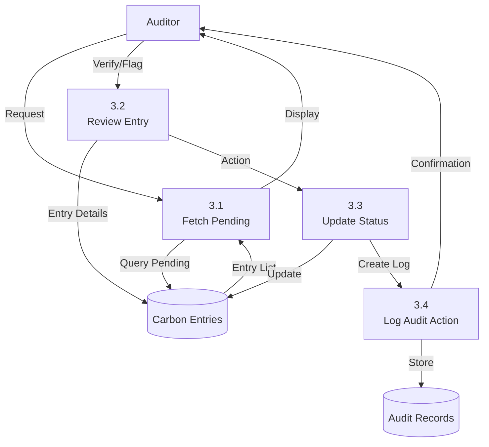
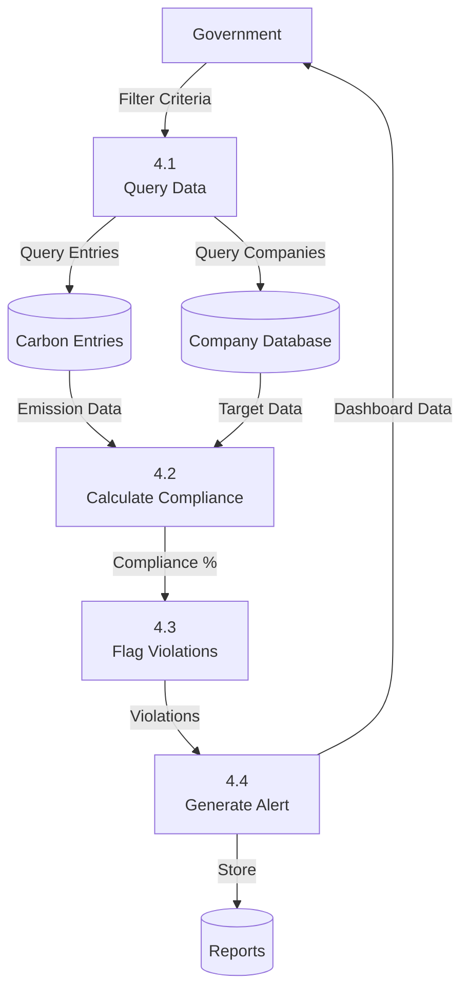
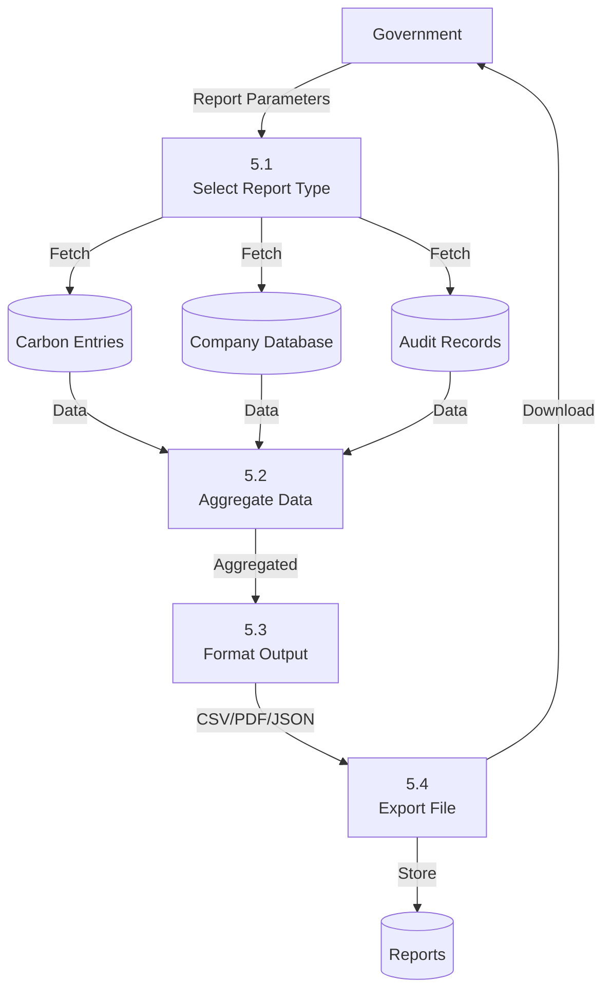

# Data Flow Diagram (DFD) - CarbonSync Platform

## Level 0 - Context Diagram



## Level 1 - High-Level DFD



## Level 2 - Detailed DFD

### 2.1 User Authentication Process



### 2.2 Emission Data Management Process



### 2.3 Audit & Verification Process



### 2.4 Compliance Monitoring Process



### 2.5 Report Generation Process



## Data Flow Details

### Authentication Flow
1. User submits email + password
2. System validates credentials against database
3. On success, generates JWT token with user role
4. Token returned to client for subsequent requests
5. Token included in Authorization header for all API calls

### Emission Submission Flow
1. Company submits emission data (Scope 1, 2, 3)
2. System validates input (positive numbers, valid date)
3. Calculates total emissions = Scope1 + Scope2 + Scope3
4. Stores entry in database with status = PENDING
5. Updates company's current_emissions total
6. Returns entry ID and confirmation

### Verification Flow
1. Auditor requests pending entries
2. System fetches all entries with status = PENDING
3. Auditor reviews entry and takes action (VERIFY/FLAG/REJECT)
4. System updates entry status
5. Creates audit record with action details
6. Notifies company of status change

### Compliance Monitoring Flow
1. Government user sets filter criteria (date range, industry, etc.)
2. System queries carbon entries and company targets
3. Calculates compliance % for each company
4. Identifies violations (emissions > target)
5. Generates dashboard with compliance overview
6. Flags non-compliant companies

### Report Export Flow
1. Government user selects report type (CSV/PDF/JSON)
2. System aggregates data from multiple tables
3. Formats data according to selected type
4. Generates downloadable file
5. Stores report metadata in database
6. Returns file to user

## Data Transformations

### Emission Calculation
```
Input: scope1, scope2, scope3
Transform: totalEmissions = scope1 + scope2 + scope3
Output: emission_value
```

### Compliance Calculation
```
Input: total_emissions, emission_target
Transform: compliance_pct = (emission_target / total_emissions) * 100
Output: compliance_percentage
Status: 
  - compliance_pct >= 100 → COMPLIANT
  - compliance_pct >= 80 → WARNING
  - compliance_pct < 80 → NON_COMPLIANT
```

### Credit Balance Update
```
Input: current_balance, emissions, credits_purchased
Transform: new_balance = current_balance - (emissions * 0.01) + credits_purchased
Output: credit_balance (must be >= 0)
```

## Data Stores

| Store | Description | Read Operations | Write Operations |
|-------|-------------|-----------------|------------------|
| D1: User Database | Auth & profile data | Login, profile view | Signup, profile update |
| D2: Company Database | Company metadata | Company list, details | Company creation, update |
| D3: Carbon Entries | Emission records | Query, filter, export | Submit, verify, update |
| D4: Audit Records | Audit trail | Audit history | Log action (append-only) |
| D5: Reports | Generated reports | Report list, download | Generate report |
| D6: Session Store | Active sessions (Redis) | Token validation | Create/destroy session |
