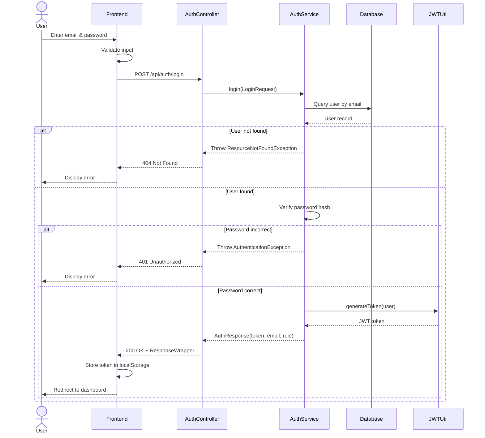
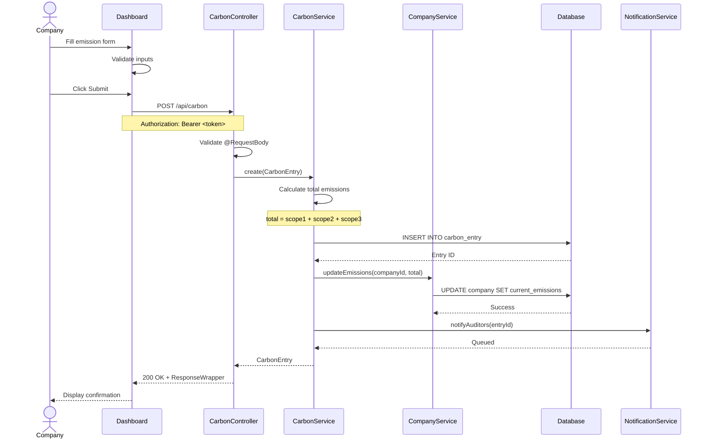
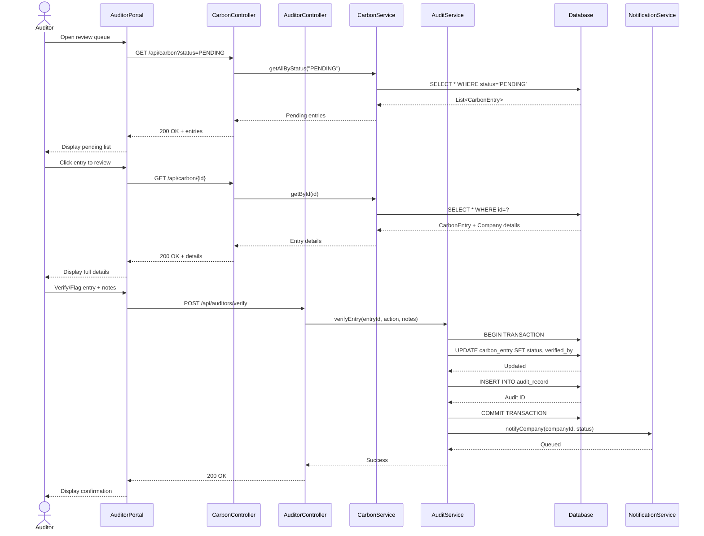
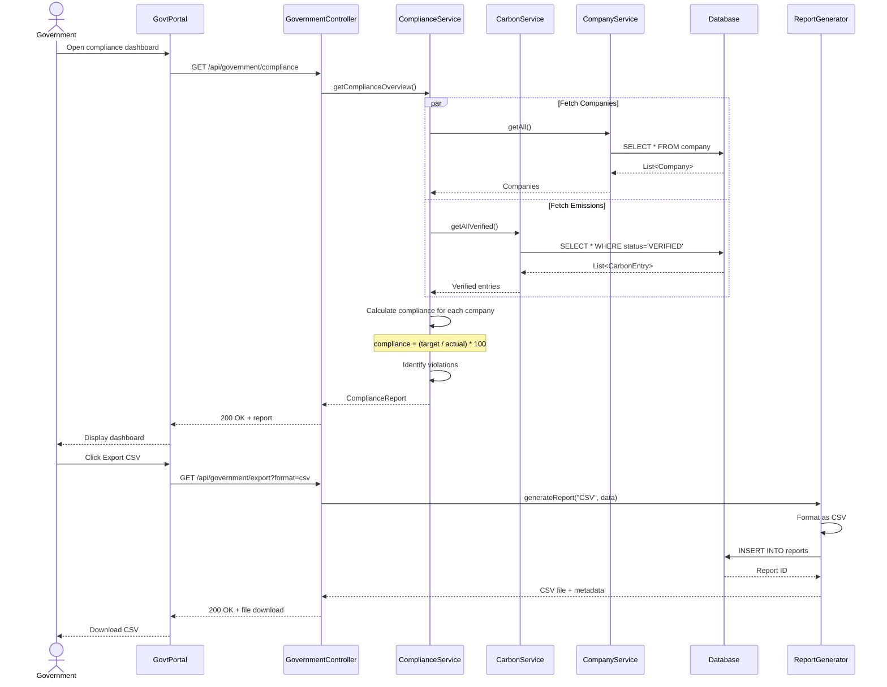
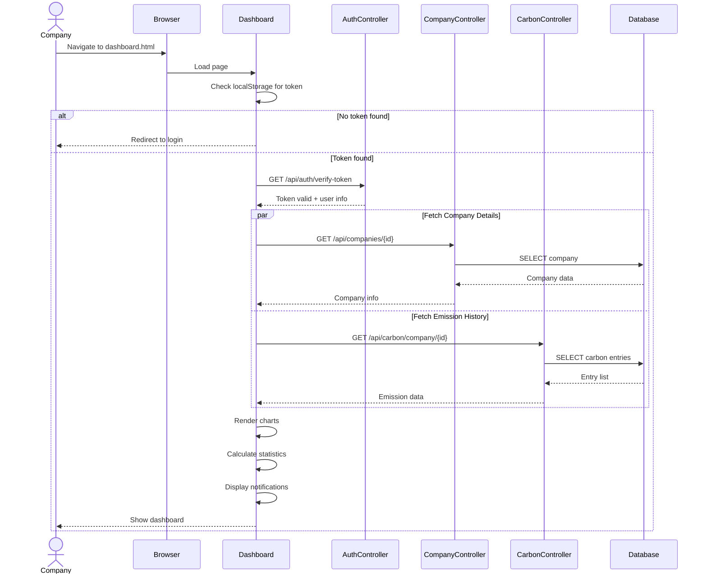
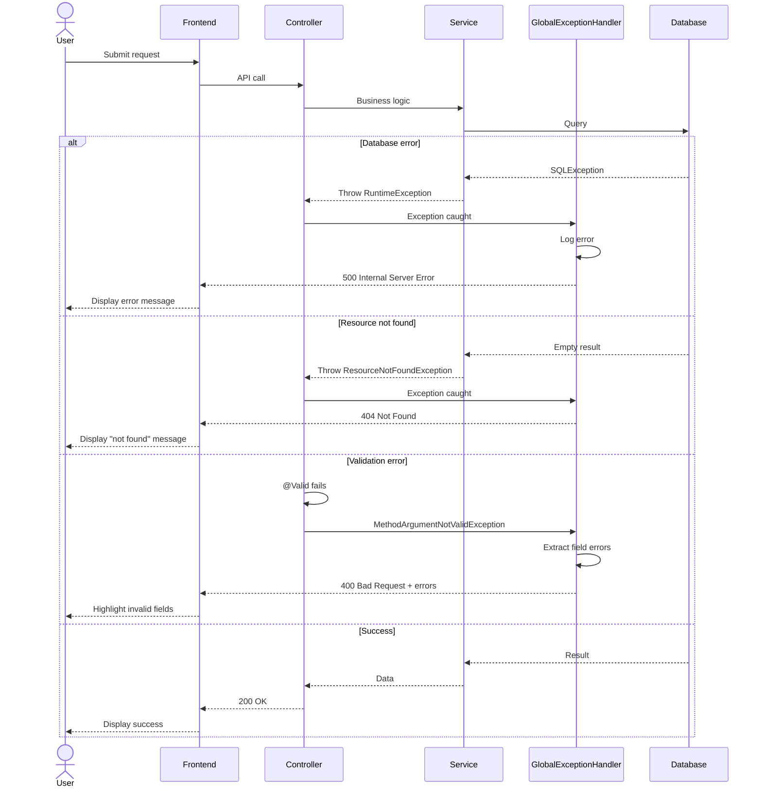
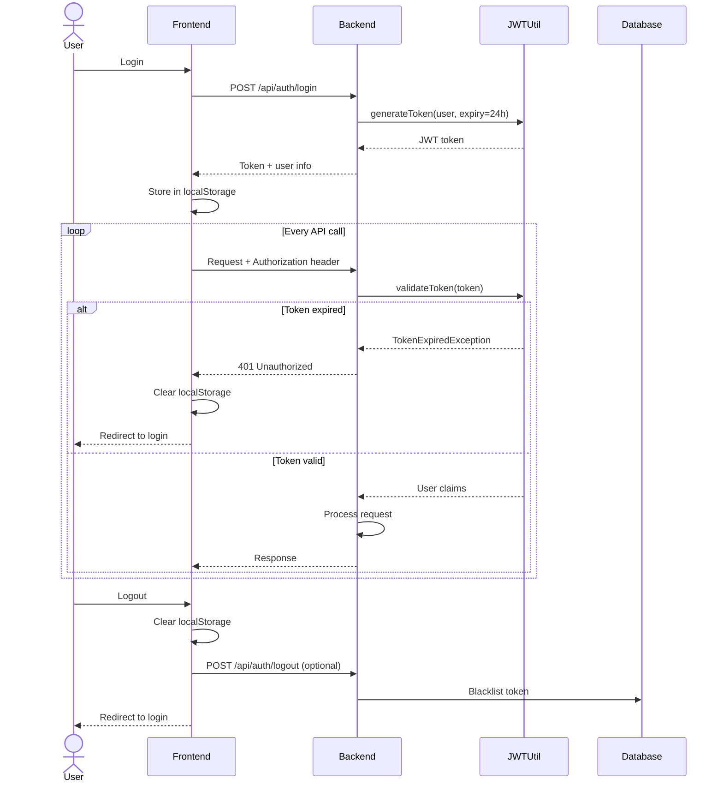

# Sequence Diagrams - CarbonSync User Flows

## 1. User Authentication Flow

## 2. Company Emission Submission Flow

## 3. Auditor Verification Flow

## 4. Government Compliance Monitoring Flow

## 5. Company Dashboard Load Flow

## 6. Error Handling Flow

## 7. Session Management Flow

## Key Interactions Summary

| Flow | Primary Actors | Key Operations | Duration |
|------|---------------|----------------|----------|
| Authentication | User, AuthService | Login, token generation | < 1 sec |
| Emission Submission | Company, CarbonService | Validate, store, notify | < 2 sec |
| Verification | Auditor, AuditService | Review, update status, log | < 3 sec |
| Compliance Monitoring | Government, ComplianceService | Aggregate, calculate, flag | < 5 sec |
| Dashboard Load | Company, Multiple services | Fetch data, render UI | < 2 sec |
| Report Export | Government, ReportGenerator | Query, format, download | < 10 sec |
