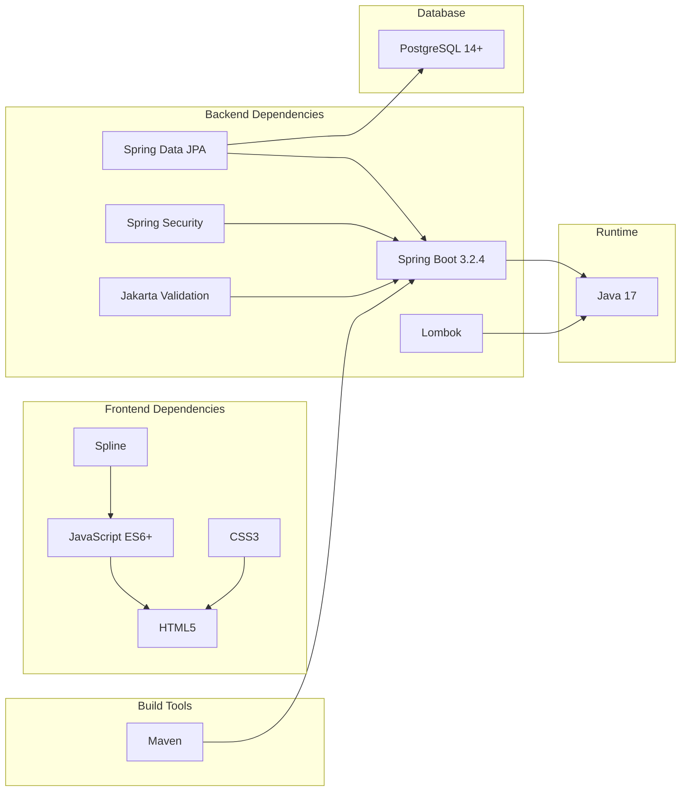
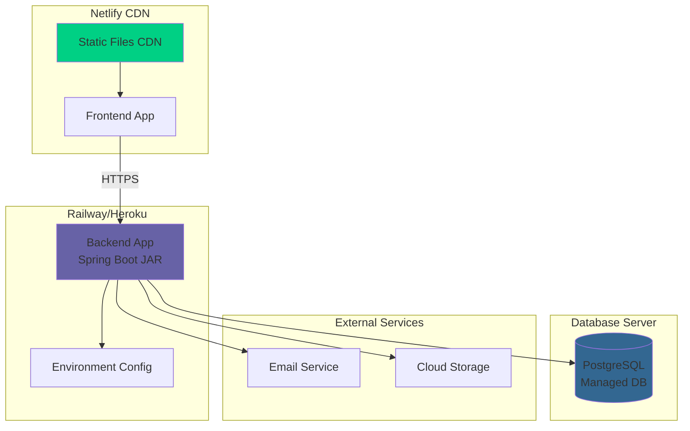

# Component Diagram - CarbonSync Architecture

## System Component Overview

```mermaid
graph TB
    subgraph "Frontend Application - Netlify"
        UI_LAYER[UI Layer]
        
        subgraph "Pages"
            LANDING[Landing Page<br/>index.html]
            LOGIN_C[Company Login<br/>login-company.html]
            LOGIN_A[Auditor Login<br/>login-auditor.html]
            LOGIN_G[Government Login<br/>login-govt.html]
            DASH_C[Company Dashboard<br/>dashboard.html]
            DASH_A[Auditor Portal<br/>auditor.html]
            DASH_G[Government Monitor<br/>government.html]
        end
        
        subgraph "Scripts"
            API_CLIENT[API Client<br/>api-wrapper.js]
            AUTH_MGR[Auth Manager<br/>auth.js]
            CHART_MGR[Chart Manager<br/>charts.js]
            GLOBE[3D Globe<br/>globe.js]
            ANIM[Animations<br/>animations.js]
        end
        
        subgraph "Styles"
            VAR[Variables<br/>variables.css]
            BASE[Base Styles<br/>base.css]
            LAYOUT[Layout<br/>layout.css]
            COMP[Components<br/>components.css]
        end
    end
    
    subgraph "Backend Application - Spring Boot"
        API_LAYER[API Layer]
        
        subgraph "Controllers"
            AUTH_CTRL[AuthController<br/>/api/auth/*]
            COMPANY_CTRL[CompanyController<br/>/api/companies/*]
            AUDITOR_CTRL[AuditorController<br/>/api/auditors/*]
            GOVT_CTRL[GovernmentController<br/>/api/government/*]
            CARBON_CTRL[CarbonController<br/>/api/carbon/*]
        end
        
        subgraph "Services"
            AUTH_SVC[AuthService]
            COMPANY_SVC[CompanyService]
            AUDITOR_SVC[AuditorService]
            GOVT_SVC[GovernmentService]
            CARBON_SVC[CarbonService]
            AUDIT_SVC[AuditService]
            REPORT_SVC[ReportService]
        end
        
        subgraph "Repositories"
            USER_REPO[UserRepository<br/>Spring Data JPA]
            COMPANY_REPO[CompanyRepository]
            AUDITOR_REPO[AuditorRepository]
            GOVT_REPO[GovernmentRepository]
            CARBON_REPO[CarbonRepository]
            AUDIT_REPO[AuditRepository]
        end
        
        subgraph "Security"
            JWT_FILTER[JWTAuthenticationFilter]
            JWT_UTIL[JWTUtil]
            SEC_CONFIG[SecurityConfig]
            CORS_CONFIG[CorsConfig]
        end
        
        subgraph "Common"
            RESPONSE[ResponseWrapper]
            EXCEPTION[GlobalExceptionHandler]
            VALIDATOR[CustomValidators]
        end
    end
    
    subgraph "Data Layer"
        DB[(PostgreSQL<br/>Database)]
        CACHE[(Redis Cache<br/>Future)]
    end
    
    subgraph "External Services"
        EMAIL[Email Service<br/>SendGrid/SES]
        STORAGE[File Storage<br/>S3/CloudStorage]
        MONITOR[Monitoring<br/>Prometheus]
    end
    
    UI_LAYER --> API_LAYER
    
    LANDING --> LOGIN_C
    LANDING --> LOGIN_A
    LANDING --> LOGIN_G
    LOGIN_C --> DASH_C
    LOGIN_A --> DASH_A
    LOGIN_G --> DASH_G
    
    DASH_C --> API_CLIENT
    DASH_A --> API_CLIENT
    DASH_G --> API_CLIENT
    API_CLIENT --> AUTH_MGR
    
    API_CLIENT --> AUTH_CTRL
    API_CLIENT --> COMPANY_CTRL
    API_CLIENT --> AUDITOR_CTRL
    API_CLIENT --> GOVT_CTRL
    API_CLIENT --> CARBON_CTRL
    
    AUTH_CTRL --> AUTH_SVC
    COMPANY_CTRL --> COMPANY_SVC
    AUDITOR_CTRL --> AUDITOR_SVC
    GOVT_CTRL --> GOVT_SVC
    CARBON_CTRL --> CARBON_SVC
    
    AUTH_SVC --> USER_REPO
    COMPANY_SVC --> COMPANY_REPO
    AUDITOR_SVC --> AUDITOR_REPO
    GOVT_SVC --> GOVT_REPO
    CARBON_SVC --> CARBON_REPO
    AUDIT_SVC --> AUDIT_REPO
    
    USER_REPO --> DB
    COMPANY_REPO --> DB
    AUDITOR_REPO --> DB
    GOVT_REPO --> DB
    CARBON_REPO --> DB
    AUDIT_REPO --> DB
    
    JWT_FILTER --> JWT_UTIL
    AUTH_CTRL --> JWT_UTIL
    SEC_CONFIG --> JWT_FILTER
    
    AUTH_CTRL --> RESPONSE
    COMPANY_CTRL --> RESPONSE
    AUDITOR_CTRL --> RESPONSE
    GOVT_CTRL --> RESPONSE
    CARBON_CTRL --> RESPONSE
    
    EXCEPTION -.-> AUTH_CTRL
    EXCEPTION -.-> COMPANY_CTRL
    EXCEPTION -.-> AUDITOR_CTRL
    EXCEPTION -.-> GOVT_CTRL
    EXCEPTION -.-> CARBON_CTRL
    
    CARBON_SVC --> EMAIL
    AUDIT_SVC --> EMAIL
    REPORT_SVC --> STORAGE
    API_LAYER --> MONITOR
    
    style DB fill:#4A90E2
    style CACHE fill:#95A5A6
    style JWT_FILTER fill:#E74C3C
    style EXCEPTION fill:#E67E22
```



## Component Descriptions

### Frontend Components

#### Pages
- **Landing Page**: Homepage with hero section, features, pricing
- **Login Pages**: Role-specific login pages (Company/Auditor/Government)
- **Company Dashboard**: Emission tracking, credit management, history
- **Auditor Portal**: Review queue, verification workflow, audit history
- **Government Monitor**: Compliance overview, reports, enforcement

#### Scripts
- **API Client**: Centralized HTTP client with error handling
- **Auth Manager**: Token storage, validation, session management
- **Chart Manager**: Data visualization using Chart.js
- **3D Globe**: Interactive globe animation using Spline
- **Animations**: Scroll effects, counters, transitions

#### Styles
- **Variables**: Design tokens (colors, typography, spacing)
- **Base Styles**: Reset, typography, global styles
- **Layout**: Grid system, containers, responsive breakpoints
- **Components**: Reusable UI components (cards, buttons, forms)

### Backend Components

#### Controllers (API Layer)
- Handle HTTP requests/responses
- Input validation using Jakarta Validation
- Route to appropriate service methods
- Return standardized ResponseWrapper

#### Services (Business Logic Layer)
- Implement core business logic
- Transaction management
- Data transformation
- Call repositories for data access
- Trigger external services (email, notifications)

#### Repositories (Data Access Layer)
- Spring Data JPA interfaces
- CRUD operations
- Custom query methods
- Entity lifecycle management

#### Security Components
- **JWTAuthenticationFilter**: Intercepts requests, validates tokens
- **JWTUtil**: Token generation, validation, extraction
- **SecurityConfig**: Spring Security configuration
- **CorsConfig**: Cross-origin resource sharing configuration

#### Common Components
- **ResponseWrapper**: Standardizes all API responses
- **GlobalExceptionHandler**: Centralized error handling
- **CustomValidators**: Business rule validators

## Component Interactions

### Authentication Flow
```
User → Login Page → API Client → AuthController → AuthService → 
UserRepository → Database → JWTUtil (generate token) → Response
```

### Data Submission Flow
```
Company → Dashboard → API Client → CarbonController → CarbonService → 
CarbonRepository → Database → Email Service (notify auditors)
```

### Verification Flow
```
Auditor → Portal → API Client → AuditorController → AuditService → 
[CarbonRepository + AuditRepository] → Database → Email Service (notify company)
```

### Report Generation Flow
```
Government → Monitor → API Client → GovernmentController → ReportService → 
[Multiple Repositories] → Database → File Storage → Download
```

## Component Dependencies



## Deployment Components



## Component Characteristics

| Component | Technology | Stateless? | Scalable? | Cacheable? |
|-----------|-----------|------------|-----------|------------|
| Frontend | HTML/CSS/JS | Yes | Yes (CDN) | Yes |
| API Controllers | Spring Boot | Yes | Yes (horizontal) | No |
| Services | Spring Boot | Yes | Yes | Partially |
| Repositories | Spring Data | No | Yes | Yes |
| Database | PostgreSQL | No | Yes (read replicas) | N/A |
| JWT Authentication | Custom | Yes | Yes | No |
| File Storage | S3/Cloud | Yes | Yes | Yes |

## Integration Points

### Internal Integrations
1. **Frontend ↔ Backend**: REST API over HTTPS
2. **Backend ↔ Database**: JDBC connection pool
3. **Controllers ↔ Services**: Dependency injection
4. **Services ↔ Repositories**: Spring Data JPA

### External Integrations
1. **Email Service**: SMTP/API for notifications
2. **File Storage**: S3 SDK for report storage
3. **Monitoring**: Prometheus metrics endpoint
4. **Logging**: Centralized logging (ELK stack - future)

## Component Lifecycle

### Frontend
- **Build**: Minify CSS/JS, optimize assets
- **Deploy**: Push to Netlify, invalidate CDN
- **Runtime**: Static file serving

### Backend
- **Build**: Maven compile, run tests, create JAR
- **Deploy**: Upload JAR to Railway/Heroku
- **Runtime**: JVM execution, auto-restart on failure

### Database
- **Setup**: Create schema, apply migrations
- **Runtime**: Connection pooling, query optimization
- **Maintenance**: Backups, vacuuming, monitoring
