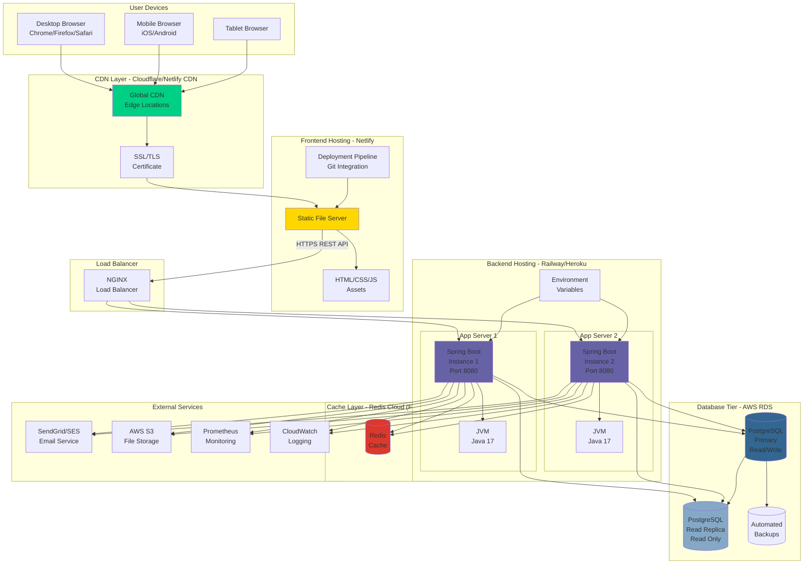
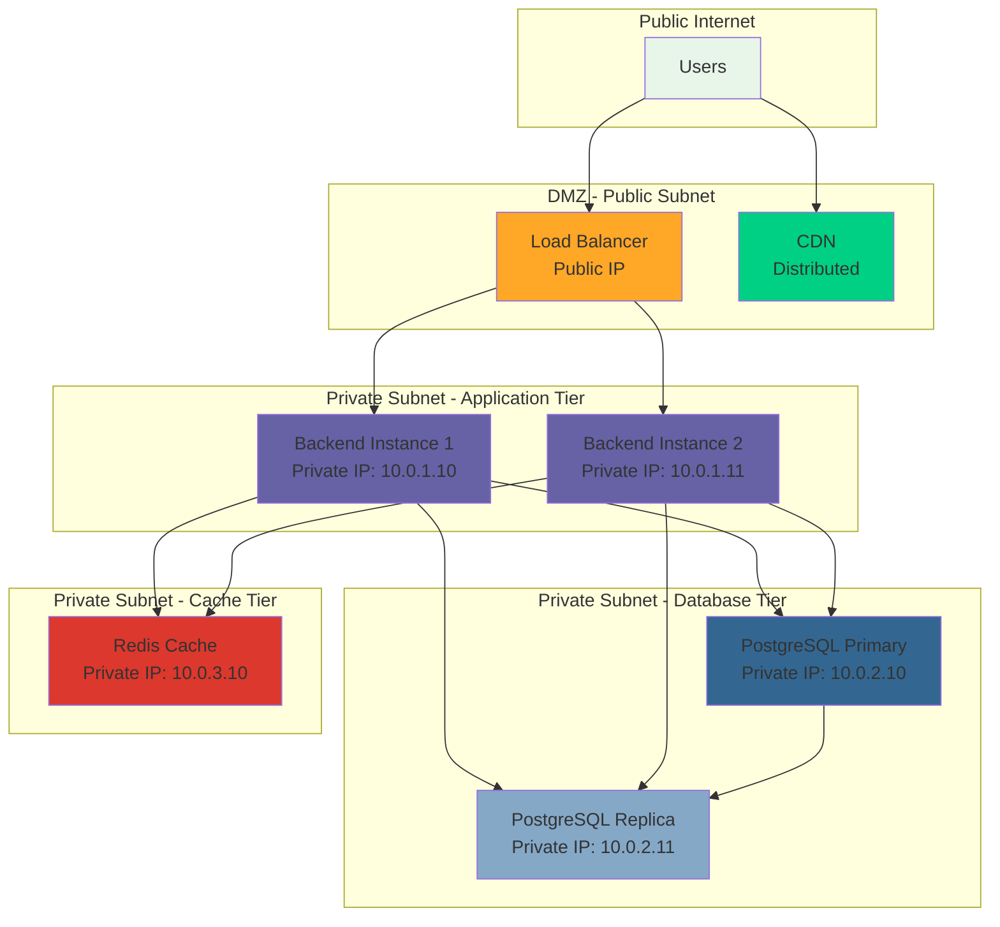
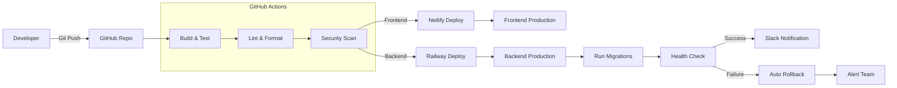

# Deployment Diagram - CarbonSync Infrastructure

## Production Deployment Architecture



## Deployment Environment Details

### Frontend Deployment (Netlify)

**Server Specifications:**
- **Platform**: Netlify CDN
- **Regions**: Global edge locations
- **Storage**: Static file hosting
- **SSL**: Auto-provisioned Let's Encrypt
- **Build**: Automatic on Git push

**Configuration:**
```yaml
# netlify.toml
[build]
  publish = "frontend/"
  
[[redirects]]
  from = "/api/*"
  to = "https://carbonsync-api.railway.app/api/:splat"
  status = 200
  force = true
  
[build.environment]
  NODE_VERSION = "18"
```

**Files Deployed:**
- HTML pages (gzipped)
- CSS stylesheets (minified)
- JavaScript (minified & tree-shaken)
- Assets (images, fonts, icons)

### Backend Deployment (Railway/Heroku)

**Server Specifications:**
- **Platform**: Railway/Heroku Container
- **CPU**: 2 vCPU per instance
- **Memory**: 1 GB RAM per instance
- **Instances**: 2 (horizontal scaling)
- **Region**: US-East
- **OS**: Linux (Docker container)
- **JVM**: OpenJDK 17
- **App Server**: Embedded Tomcat 10

**Container Image:**
```dockerfile
FROM openjdk:17-slim
WORKDIR /app
COPY target/carbonsync-0.0.1-SNAPSHOT.jar app.jar
EXPOSE 8080
ENTRYPOINT ["java", "-Xmx768m", "-jar", "app.jar"]
```

**Environment Variables:**
```bash
SPRING_PROFILES_ACTIVE=production
DATABASE_URL=jdbc:postgresql://rds-instance:5432/carbonsync
DATABASE_USERNAME=carbonsync_user
DATABASE_PASSWORD=<encrypted>
JWT_SECRET=<encrypted>
JWT_EXPIRATION=86400000
SENDGRID_API_KEY=<encrypted>
AWS_S3_BUCKET=carbonsync-reports
CORS_ALLOWED_ORIGINS=https://carbon-sync.netlify.app
```

### Database Deployment (AWS RDS)

**Server Specifications:**
- **Engine**: PostgreSQL 14.10
- **Instance Class**: db.t3.medium
- **vCPU**: 2 cores
- **Memory**: 4 GB RAM
- **Storage**: 100 GB SSD (gp3)
- **IOPS**: 3000
- **Multi-AZ**: Yes (automatic failover)
- **Backups**: Daily automated backups (7-day retention)
- **Read Replica**: 1 instance (same specs)

**Connection Pooling:**
```properties
# HikariCP configuration
spring.datasource.hikari.maximum-pool-size=20
spring.datasource.hikari.minimum-idle=5
spring.datasource.hikari.connection-timeout=30000
spring.datasource.hikari.idle-timeout=600000
spring.datasource.hikari.max-lifetime=1800000
```

**Database Security:**
- VPC with private subnet
- Security group: Allow 5432 only from backend IPs
- SSL/TLS enforced connections
- Encrypted at rest (AES-256)

### Load Balancer (NGINX)

**Configuration:**
```nginx
upstream backend {
    least_conn;
    server backend-1:8080 max_fails=3 fail_timeout=30s;
    server backend-2:8080 max_fails=3 fail_timeout=30s;
}

server {
    listen 443 ssl http2;
    server_name api.carbonsync.com;
    
    ssl_certificate /etc/ssl/certs/carbonsync.crt;
    ssl_certificate_key /etc/ssl/private/carbonsync.key;
    
    location /api/ {
        proxy_pass http://backend;
        proxy_set_header Host $host;
        proxy_set_header X-Real-IP $remote_addr;
        proxy_set_header X-Forwarded-For $proxy_add_x_forwarded_for;
        proxy_connect_timeout 60s;
        proxy_read_timeout 120s;
    }
    
    location /health {
        proxy_pass http://backend/actuator/health;
    }
}
```

## Network Architecture



## CI/CD Pipeline



### Pipeline Configuration

**GitHub Actions Workflow:**
```yaml
name: Deploy CarbonSync

on:
  push:
    branches: [main]

jobs:
  frontend:
    runs-on: ubuntu-latest
    steps:
      - uses: actions/checkout@v3
      - name: Deploy to Netlify
        uses: netlify/actions/cli@master
        with:
          args: deploy --prod --dir=frontend
        env:
          NETLIFY_AUTH_TOKEN: ${{ secrets.NETLIFY_TOKEN }}
          NETLIFY_SITE_ID: ${{ secrets.NETLIFY_SITE_ID }}
  
  backend:
    runs-on: ubuntu-latest
    steps:
      - uses: actions/checkout@v3
      - name: Set up JDK 17
        uses: actions/setup-java@v3
        with:
          java-version: '17'
      - name: Build with Maven
        run: cd backend && mvn clean package
      - name: Deploy to Railway
        uses: bervProject/railway-deploy@main
        with:
          railway_token: ${{ secrets.RAILWAY_TOKEN }}
          service: backend
```

## Monitoring & Observability

### Metrics Collection

**Spring Boot Actuator Endpoints:**
```
GET /actuator/health - Health status
GET /actuator/metrics - Application metrics
GET /actuator/prometheus - Prometheus-formatted metrics
```

**Prometheus Configuration:**
```yaml
scrape_configs:
  - job_name: 'carbonsync-backend'
    scrape_interval: 15s
    static_configs:
      - targets: ['backend-1:8080', 'backend-2:8080']
    metrics_path: /actuator/prometheus
```

**Key Metrics Monitored:**
- JVM memory usage
- HTTP request rate & latency
- Database connection pool utilization
- API endpoint response times
- Error rates (4xx, 5xx)
- Active user sessions

### Logging

**Log Aggregation:**
- **Frontend**: Netlify logs (access, build)
- **Backend**: CloudWatch Logs (application, error)
- **Database**: RDS logs (query, slow query)

**Log Format:**
```json
{
  "timestamp": "2025-03-31T10:30:45Z",
  "level": "INFO",
  "service": "backend",
  "instance": "backend-1",
  "trace_id": "abc123",
  "message": "POST /api/carbon completed",
  "duration_ms": 145,
  "status": 200
}
```

## Disaster Recovery

### Backup Strategy
- **Database**: Automated daily backups (7-day retention)
- **Point-in-time recovery**: Up to 5 minutes ago
- **Cross-region backup**: Weekly to US-West
- **Application code**: Git version control
- **Environment config**: Encrypted secrets in Railway/Heroku

### Recovery Procedures
1. **Backend failure**: Auto-restart, load balancer routes to healthy instance
2. **Database failure**: Automatic failover to Multi-AZ standby (< 60 sec)
3. **Complete outage**: Restore from latest backup, redeploy from Git

### RTO & RPO
- **Recovery Time Objective (RTO)**: 15 minutes
- **Recovery Point Objective (RPO)**: 5 minutes

## Scaling Strategy

### Horizontal Scaling
- **Frontend**: Auto-scaled by CDN (unlimited)
- **Backend**: Manual/auto-scale to 5 instances (Railway)
- **Database**: Read replicas for read-heavy operations

### Vertical Scaling
- **Backend**: Upgrade to 4 vCPU, 2 GB RAM if needed
- **Database**: Upgrade to db.t3.large (2 vCPU, 8 GB RAM)

### Caching Strategy (Future)
- **Redis**: Cache frequently accessed data (company list, auditor list)
- **CDN**: Cache static API responses with short TTL
- **Database**: Query result caching for reports

## Security Measures

### Network Security
- **Firewall**: Security groups allow only necessary ports
- **DDoS Protection**: Cloudflare DDoS mitigation
- **WAF**: Web Application Firewall on load balancer

### Application Security
- **HTTPS**: Enforced on all connections
- **CORS**: Restricted to frontend domain
- **Rate Limiting**: 100 requests/minute per IP
- **Input Validation**: All inputs sanitized
- **SQL Injection**: Parameterized queries only

### Data Security
- **Encryption at Rest**: AES-256 for database
- **Encryption in Transit**: TLS 1.3
- **Secret Management**: Encrypted environment variables
- **Access Control**: IAM roles, least privilege

## Cost Estimation (Monthly)

| Service | Cost |
|---------|------|
| Netlify (Frontend) | $0 (Free tier) |
| Railway (Backend 2 instances) | $20 |
| AWS RDS (db.t3.medium + replica) | $120 |
| AWS S3 (File storage) | $10 |
| SendGrid (Email) | $15 |
| Domain & SSL | $15 |
| **Total** | **~$180/month** |
