# Use Case Diagram - CarbonSync Platform

## System Use Cases

```mermaid
graph TB
    subgraph "Actors"
        COMPANY[Company User]
        AUDITOR[Auditor User]
        GOVT[Government User]
        SYSTEM[System/Scheduler]
    end
    
    subgraph "CarbonSync Platform"
        subgraph "Authentication"
            UC1[UC-1: Register Account]
            UC2[UC-2: Login]
            UC3[UC-3: Logout]
            UC4[UC-4: Reset Password]
        end
        
        subgraph "Company Operations"
            UC5[UC-5: Submit Emission Data]
            UC6[UC-6: View Emission History]
            UC7[UC-7: Track Carbon Credits]
            UC8[UC-8: Purchase Carbon Credits]
            UC9[UC-9: View Verification Status]
            UC10[UC-10: Update Company Profile]
            UC11[UC-11: Download Reports]
        end
        
        subgraph "Auditor Operations"
            UC12[UC-12: View Review Queue]
            UC13[UC-13: Review Emission Entry]
            UC14[UC-14: Verify Entry]
            UC15[UC-15: Flag Entry]
            UC16[UC-16: Reject Entry]
            UC17[UC-17: Request Additional Info]
            UC18[UC-18: View Audit History]
        end
        
        subgraph "Government Operations"
            UC19[UC-19: Monitor National Emissions]
            UC20[UC-20: View Company Compliance]
            UC21[UC-21: Generate Compliance Report]
            UC22[UC-22: Export Data CSV/PDF/JSON]
            UC23[UC-23: Flag Non-Compliant Companies]
            UC24[UC-24: Issue Enforcement Notice]
            UC25[UC-25: View Industry Statistics]
        end
        
        subgraph "System Operations"
            UC26[UC-26: Send Email Notifications]
            UC27[UC-27: Calculate Compliance Scores]
            UC28[UC-28: Generate Periodic Reports]
            UC29[UC-29: Archive Old Data]
        end
    end
    
    COMPANY --> UC1
    COMPANY --> UC2
    COMPANY --> UC3
    COMPANY --> UC4
    COMPANY --> UC5
    COMPANY --> UC6
    COMPANY --> UC7
    COMPANY --> UC8
    COMPANY --> UC9
    COMPANY --> UC10
    COMPANY --> UC11
    
    AUDITOR --> UC2
    AUDITOR --> UC3
    AUDITOR --> UC4
    AUDITOR --> UC12
    AUDITOR --> UC13
    AUDITOR --> UC14
    AUDITOR --> UC15
    AUDITOR --> UC16
    AUDITOR --> UC17
    AUDITOR --> UC18
    
    GOVT --> UC2
    GOVT --> UC3
    GOVT --> UC4
    GOVT --> UC19
    GOVT --> UC20
    GOVT --> UC21
    GOVT --> UC22
    GOVT --> UC23
    GOVT --> UC24
    GOVT --> UC25
    
    SYSTEM --> UC26
    SYSTEM --> UC27
    SYSTEM --> UC28
    SYSTEM --> UC29
    
    UC5 -.includes.-> UC2
    UC6 -.includes.-> UC2
    UC12 -.includes.-> UC2
    UC19 -.includes.-> UC2
    
    UC14 -.extends.-> UC13
    UC15 -.extends.-> UC13
    UC16 -.extends.-> UC13
    
    UC22 -.includes.-> UC21
    
    style COMPANY fill:#3498DB
    style AUDITOR fill:#2ECC71
    style GOVT fill:#F39C12
    style SYSTEM fill:#95A5A6
```

## Detailed Use Case Descriptions

### UC-1: Register Account

**Actor**: Company User, Auditor User, Government User

**Preconditions**: None

**Main Flow**:
1. User navigates to signup page
2. User selects role (Company/Auditor/Government)
3. User fills registration form (name, email, password)
4. System validates input
5. System creates user account
6. System sends verification email
7. User verifies email
8. System activates account

**Postconditions**: User account created and activated

**Alternative Flows**:
- **A1**: Email already exists → Display error
- **A2**: Invalid email format → Display validation error
- **A3**: Password too weak → Display strength requirements

---

### UC-5: Submit Emission Data

**Actor**: Company User

**Preconditions**: User is logged in as Company

**Main Flow**:
1. Company navigates to dashboard
2. Company clicks "Submit Emissions"
3. System displays emission form
4. Company enters Scope 1, 2, 3 emissions
5. Company enters report date
6. Company submits form
7. System validates data
8. System calculates total emissions
9. System stores entry with status PENDING
10. System notifies auditors
11. System displays confirmation

**Postconditions**: Emission entry created, auditors notified

**Alternative Flows**:
- **A1**: Invalid data → Display validation errors
- **A2**: Future report date → Display error
- **A3**: Network error → Retry with exponential backoff

---

### UC-13: Review Emission Entry

**Actor**: Auditor User

**Preconditions**: User is logged in as Auditor, pending entries exist

**Main Flow**:
1. Auditor opens review queue
2. System displays pending entries
3. Auditor selects entry to review
4. System displays entry details + company info
5. Auditor examines data
6. Auditor decides action (Verify/Flag/Reject/Request Info)
7. Auditor enters notes
8. Auditor submits review
9. System updates entry status
10. System logs audit action
11. System notifies company
12. System displays confirmation

**Postconditions**: Entry status updated, audit logged, company notified

**Alternative Flows**:
- **A1**: Entry already reviewed → Display notification
- **A2**: Missing information → Extend to UC-17 (Request Info)

---

### UC-20: View Company Compliance

**Actor**: Government User

**Preconditions**: User is logged in as Government

**Main Flow**:
1. Government opens compliance dashboard
2. System fetches all companies
3. System fetches verified emissions
4. System calculates compliance for each company
5. System displays compliance table
6. Government filters by industry/status
7. System updates table
8. Government selects company
9. System displays detailed compliance report

**Postconditions**: Compliance data displayed

**Alternative Flows**:
- **A1**: No data for period → Display "No data" message
- **A2**: Calculation error → Display error notification

---

### UC-22: Export Data (CSV/PDF/JSON)

**Actor**: Government User

**Preconditions**: User is logged in as Government, data exists

**Main Flow**:
1. Government selects export option
2. System displays export dialog
3. Government selects format (CSV/PDF/JSON)
4. Government selects date range
5. Government clicks Export
6. System aggregates data
7. System formats data
8. System generates file
9. System stores file metadata
10. System initiates download
11. System logs export action

**Postconditions**: Data exported, file downloaded, action logged

**Alternative Flows**:
- **A1**: No data for range → Display error
- **A2**: File too large → Offer to email link

---

### UC-26: Send Email Notifications (System)

**Actor**: System/Scheduler

**Preconditions**: Notification trigger event occurred

**Main Flow**:
1. Event occurs (entry submitted, status changed, etc.)
2. System identifies recipients
3. System selects email template
4. System populates template with data
5. System sends email via SendGrid
6. System logs email sent
7. System handles bounce/failure

**Postconditions**: Email sent and logged

**Alternative Flows**:
- **A1**: Email service unavailable → Queue for retry
- **A2**: Recipient unsubscribed → Skip sending

---

## Use Case Relationships

### «include» Relationships
- All authenticated operations **include** UC-2 (Login)
- UC-22 (Export Data) **includes** UC-21 (Generate Report)
- UC-14, UC-15, UC-16 (Verify/Flag/Reject) **include** UC-13 (Review Entry)

### «extend» Relationships
- UC-14 (Verify Entry) **extends** UC-13 (Review Entry)
- UC-15 (Flag Entry) **extends** UC-13 (Review Entry)
- UC-16 (Reject Entry) **extends** UC-13 (Review Entry)
- UC-17 (Request Info) **extends** UC-13 (Review Entry)

### Generalization
- UC-2 (Login) is **generalized** for Company, Auditor, Government
- UC-4 (Reset Password) is **generalized** for all user types

---

## Use Case Priority Matrix

| Priority | Use Cases |
|----------|-----------|
| **Critical** | UC-1, UC-2, UC-5, UC-13, UC-14, UC-19 |
| **High** | UC-6, UC-9, UC-12, UC-20, UC-21, UC-22 |
| **Medium** | UC-7, UC-8, UC-10, UC-15, UC-16, UC-23, UC-24 |
| **Low** | UC-3, UC-4, UC-11, UC-17, UC-18, UC-25 |
| **Future** | UC-8, UC-24, UC-29 |

---

## Actor Permissions Matrix

| Use Case | Company | Auditor | Government | System |
|----------|---------|---------|------------|--------|
| UC-1: Register | ✓ | ✓ | ✓ | |
| UC-2: Login | ✓ | ✓ | ✓ | |
| UC-5: Submit Emission | ✓ | | | |
| UC-6: View History | ✓ | | | |
| UC-12: View Review Queue | | ✓ | | |
| UC-13: Review Entry | | ✓ | | |
| UC-14: Verify Entry | | ✓ | | |
| UC-19: Monitor Emissions | | | ✓ | |
| UC-20: View Compliance | | | ✓ | |
| UC-22: Export Data | | | ✓ | |
| UC-26: Send Notifications | | | | ✓ |
| UC-27: Calculate Compliance | | | | ✓ |

---

## Use Case Complexity Estimates

| Use Case | Complexity | Estimated Effort |
|----------|------------|------------------|
| UC-1: Register | Medium | 8 hours |
| UC-2: Login | Low | 4 hours |
| UC-5: Submit Emission | High | 16 hours |
| UC-13: Review Entry | High | 20 hours |
| UC-14: Verify Entry | Medium | 12 hours |
| UC-20: View Compliance | High | 24 hours |
| UC-22: Export Data | High | 20 hours |
| UC-26: Send Notifications | Medium | 12 hours |

**Total Estimated Effort**: ~200 hours (5 weeks with 1 developer)
